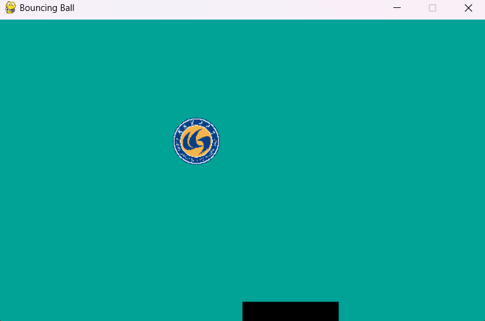
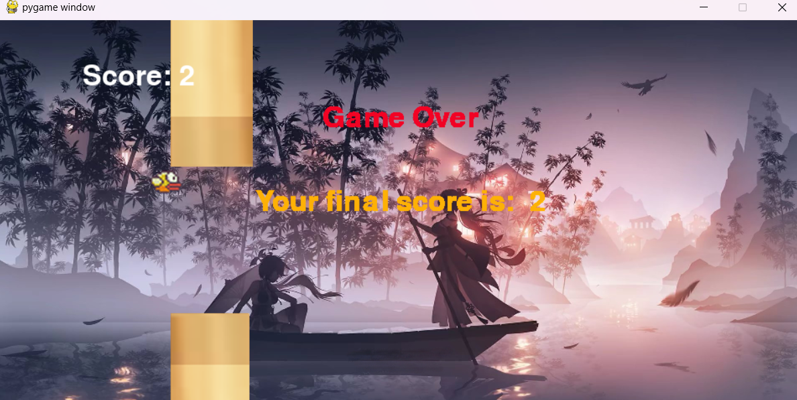

# SimplePygame

仓库包含使用Python（主要使用Pygame模块）编写的一些简单小游戏

The repository contains some simple games written in Python (mainly using Pygame modules).

---

## 文件说明

对仓库主要内容的说明

### 快速模板

- SimpleTemplate.py  
  使用Pygame模块开发游戏时使用的一般框架，不含具体的游戏逻辑，但是可以帮助你快速开启一个新的游戏项目

### 游戏列表

- BouncingBall  
  挡板弹球小游戏（破损不堪版），用挡板接住移动的小球，如果成功接住则会将小球弹走

  

- FlappyBird  
  简易版Flappy Bird小游戏，相信很多人都玩过。点一下小鸟跳一下，不点的时候小鸟会往下掉，穿越管道可以得分，代码只实现了主要的游戏逻辑，非常简陋但容易理解

  

- MarieAdventure  
  简易版马里奥小游戏。空格可以跳跃，穿越管道或躲避导弹可以得分。还有音乐和音效，并且可以手动关闭背景音乐

  

## 食用指南

各个小游戏文件夹对应的使用方法与一些注意事项

- BouncingBall  
  运行文件夹下的Src/main.py即可开始游戏，按键<-,->控制挡板移动，如果运行失败可以检查一下加载小球图片的文件路径
- FlappyBird  
  同上，按键或者鼠标点击可以控制小鸟跳跃，不过代码仅含基础逻辑，如有需要可自行扩展
- MarieAdventure  
  空格跳跃躲避地上的管道和飞来的导弹，并且配置了音效与音乐

> [!Important]
> 本仓库中的所有小游戏代码中的文件路径都是以SimplePygame为根目录的，所以你如果单独打开某个游戏文件夹为工作区直接运行的话会报错，如有需要可以自行修改文件路径或者直接从根目录SimplePygame打开工作区

### 参考书目

- Python游戏开发从入门到进阶实战[明日科技],2024/4,化学工业出版社.
